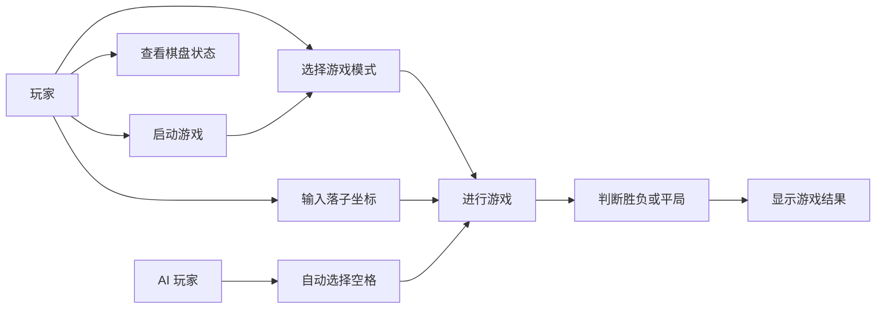
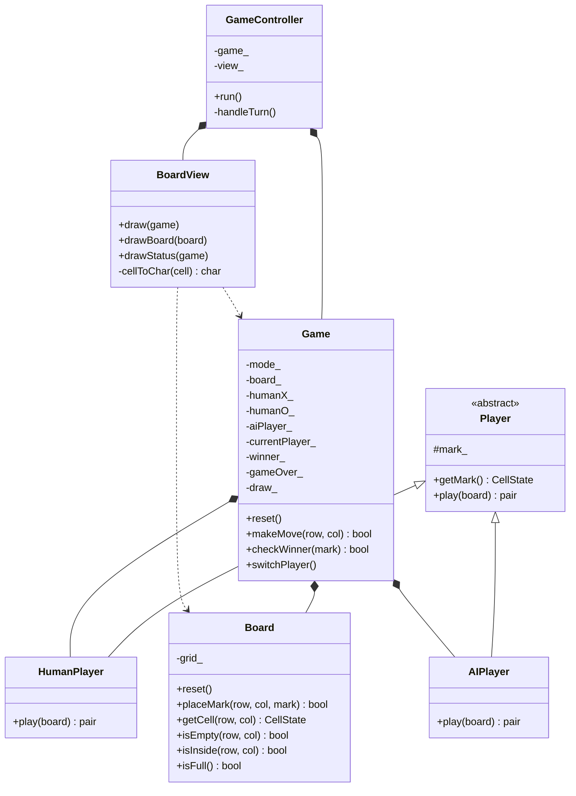
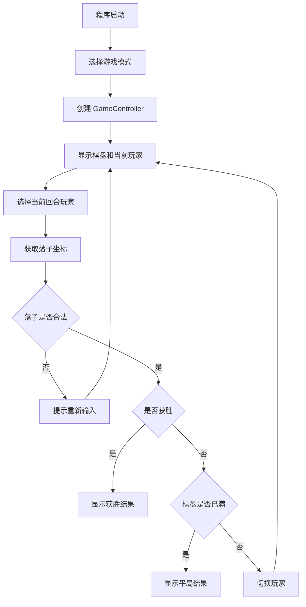

# 水利水电工程2401班-崔采琳-软件工程大作业

## 一、项目概述

本项目是一个基于 MVC 架构的命令行井字棋游戏，使用 C++ 实现，能够在 Windows + Visual Studio 环境下编译运行。游戏采用经典 3x3 棋盘，两名玩家轮流落子，任意一方在横向、纵向或对角线上形成三个连续相同棋子时获胜；如果棋盘被填满且无人获胜，则判定为平局。

项目支持两种游戏模式：

1. 双人对战：玩家 X 和玩家 O 均由用户输入坐标完成落子。
2. 人机对战：玩家 X 由用户控制，玩家 O 由简单 AI 自动选择第一个可落子的空格。

代码仓库链接：待填写 GitHub 仓库链接

## 二、需求分析

### 2.1 功能需求

- 程序启动后，用户可以选择双人对战或人机对战模式。
- 程序在命令行中显示棋盘、坐标说明和当前回合。
- 玩家通过输入行号和列号完成落子。
- 程序能够判断非法输入、越界坐标和重复落子。
- 程序能够判断横向、纵向和两条对角线的胜利情况。
- 程序能够在棋盘填满且无人获胜时判定平局。
- 游戏结束后显示最终结果。

### 2.2 非功能需求

- 使用 C++ 语言实现。
- 保持 Model、View、Controller 职责分离。
- 程序应能在 Windows + Visual Studio 环境下正常编译和运行。
- 代码结构清晰，类职责明确，便于维护和扩展。

## 三、用例图



## 四、系统架构设计

项目采用 MVC 架构：

- Model 层：负责棋盘状态、玩家信息、当前回合、胜负和平局判断等核心逻辑，主要由 `Board`、`Game`、`Player`、`HumanPlayer`、`AIPlayer` 组成。
- View 层：负责在命令行中绘制棋盘和显示游戏状态，主要由 `BoardView` 组成。
- Controller 层：负责游戏主循环、玩家选择、调用落子逻辑和推动游戏状态变化，主要由 `GameController` 组成。

## 五、类图



## 六、主要类职责

### Board

`Board` 类保存 3x3 棋盘状态，提供重置棋盘、判断坐标是否合法、判断格子是否为空、放置棋子和判断棋盘是否已满等功能。

### Game

`Game` 类是核心游戏模型，保存当前游戏模式、棋盘、玩家对象、当前玩家、胜者和游戏结束状态。它负责执行落子、判断胜利、判断平局和切换当前玩家。

### Player、HumanPlayer、AIPlayer

`Player` 是抽象玩家基类，保存玩家棋子类型并定义 `play` 接口。`HumanPlayer` 从命令行读取用户输入坐标，`AIPlayer` 按从上到下、从左到右的顺序选择第一个空格。

### BoardView

`BoardView` 负责显示命令行界面，包括棋盘坐标、棋盘内容、当前回合和游戏结果。

### GameController

`GameController` 控制游戏流程。它在主循环中调用视图显示状态，根据游戏模式和当前玩家选择对应的玩家对象，调用玩家落子逻辑，并通过 `Game::makeMove` 更新游戏状态。

## 七、游戏运行流程



## 八、运行与测试

### 8.1 双人对战测试

测试步骤：

1. 启动程序。
2. 选择 `1. 双人对战`。
3. 依次输入：

```text
0 0
1 0
0 1
1 1
0 2
```

预期结果：玩家 X 在第一行连成三个棋子，程序显示 `游戏结束：玩家 X 获胜！`。

截图位置：待补充双人对战胜利截图。

### 8.2 人机对战测试

测试步骤：

1. 启动程序。
2. 选择 `2. 人机对战`。
3. 玩家 X 输入一个合法坐标，例如 `1 1`。

预期结果：AI 玩家 O 自动选择第一个空格，并显示类似 `AI 选择位置：0 0` 的提示。

截图位置：待补充人机对战截图。

### 8.3 非法输入测试

测试步骤：

1. 在玩家输入坐标时输入字母或超出范围的坐标。
2. 再输入合法坐标。

预期结果：程序提示输入无效、坐标超出范围或该位置已有棋子，并要求重新输入。

截图位置：待补充非法输入截图。

## 九、项目总结

本项目通过 MVC 架构将游戏数据、界面显示和流程控制分离。`Game` 和 `Board` 负责核心规则，`BoardView` 负责命令行显示，`GameController` 负责组织游戏循环。这样的结构降低了各模块之间的耦合度，使代码更容易理解、测试和扩展。

通过本次大作业，我进一步理解了 MVC 架构在小型命令行程序中的应用，也练习了使用类、继承、多态和 Git 版本管理来完成一个完整的软件工程项目。
