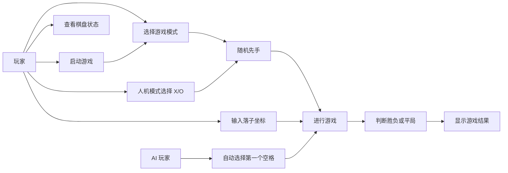
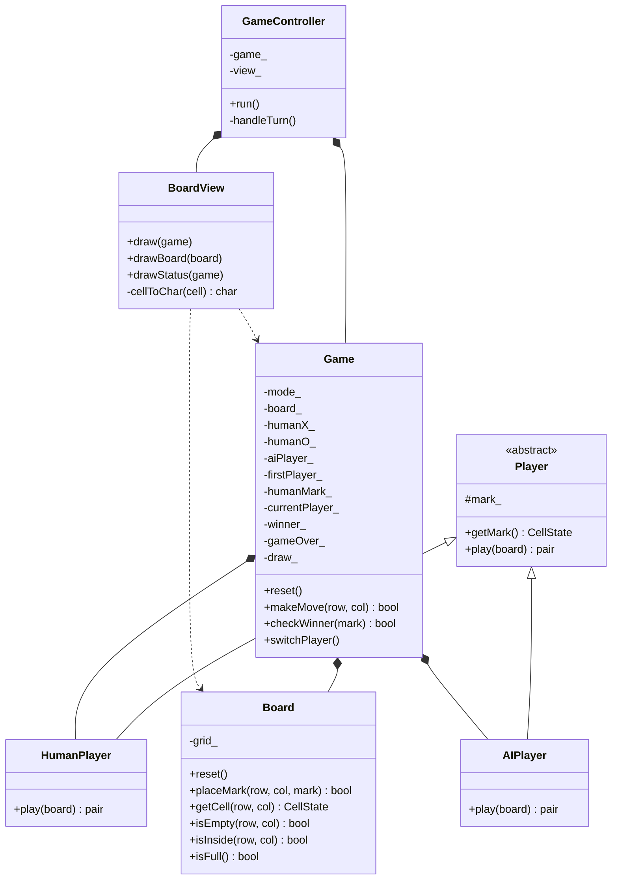
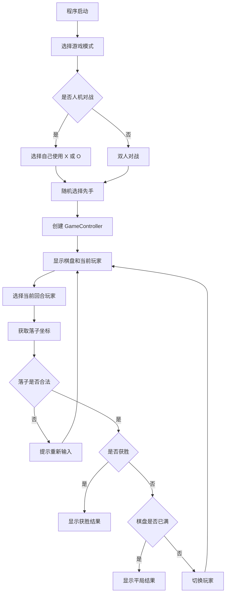

# 水利水电工程2401班-崔采琳-软件工程大作业

## 一、项目概述

本项目是一个基于 MVC 架构的命令行井字棋游戏，使用 C++ 实现，并能够在 Windows + Visual Studio 环境下编译运行。游戏采用经典 3x3 棋盘，两名玩家轮流落子，任意一方在横向、纵向或对角线上形成三个连续相同棋子即获胜；如果棋盘被填满且无人获胜，则判定为平局。

项目支持两种游戏模式：

1. 双人对战：玩家 X 和玩家 O 均由用户输入坐标完成落子。
2. 人机对战：用户可以选择自己使用 X 或 O，另一方由简单 AI 控制，AI 会自动选择第一个可落子的空格。

为了增加游戏的不确定性，程序在每局开始时会随机选择 X 或 O 先手，使游戏过程不再固定由某一方开始。

代码仓库链接：https://github.com/user-name123322/ProjectMorpion

## 二、需求分析

### 2.1 功能需求

- 程序启动后，用户可以选择双人对战或人机对战模式。
- 人机对战模式下，用户可以选择自己成为 X 方或 O 方。
- 每局游戏开始时，程序随机选择 X 或 O 先手。
- 程序在命令行中显示棋盘、坐标说明和当前回合。
- 玩家通过输入行号和列号完成落子。
- 程序能够处理非数字输入、越界坐标和重复落子等异常情况。
- 程序能够判断横向、纵向和两条对角线的胜利情况。
- 程序能够在棋盘填满且无人获胜时判定为平局。
- 游戏结束后显示获胜玩家或平局结果。

### 2.2 非功能需求

- 使用 C++ 语言实现。
- 采用 MVC 架构，保持 Model、View、Controller 职责分离。
- 程序能在 Windows + Visual Studio 环境下正常编译和运行。
- 代码结构清晰，类职责明确，便于维护和扩展。
- 使用 GitHub 仓库保存项目代码，便于查看和提交。

## 三、用例图



## 四、系统架构设计

项目采用 MVC 架构：

- Model 层：负责棋盘状态、玩家信息、当前回合、胜负判断和平局判断等核心逻辑，主要由 `Board`、`Game`、`Player`、`HumanPlayer`、`AIPlayer` 组成。
- View 层：负责在命令行中显示棋盘、当前玩家和游戏结果，主要由 `BoardView` 组成。
- Controller 层：负责控制游戏流程，包括选择当前回合玩家、调用玩家落子逻辑、更新游戏状态和推动游戏主循环，主要由 `GameController` 组成。

这种划分使棋盘数据、界面显示和流程控制相互分离，降低了模块之间的耦合度，也使各个类的职责更加清晰。

## 五、类图



## 六、主要类职责

### 6.1 Board

`Board` 类保存 3x3 棋盘状态，提供重置棋盘、判断坐标是否合法、判断格子是否为空、放置棋子和判断棋盘是否已满等功能。

### 6.2 Game

`Game` 类是核心游戏模型，保存游戏模式、棋盘对象、玩家对象、随机先手方、当前玩家、胜者和游戏结束状态。它负责执行落子、判断胜利、判断平局并切换当前玩家。

### 6.3 Player、HumanPlayer、AIPlayer

`Player` 是抽象玩家基类，保存玩家棋子类型并定义 `play` 接口。`HumanPlayer` 从命令行读取用户输入坐标，`AIPlayer` 按从上到下、从左到右的顺序选择第一个可落子的空格。

### 6.4 BoardView

`BoardView` 负责显示命令行界面，包括棋盘坐标、棋盘内容、当前回合和游戏结果。

### 6.5 GameController

`GameController` 控制游戏流程。它在主循环中调用视图显示状态，根据游戏模式和当前玩家选择对应的玩家对象，调用玩家落子逻辑，并通过 `Game::makeMove` 更新游戏状态。

## 七、游戏运行流程



## 八、运行与测试

### 8.1 开发环境

- 操作系统：Windows
- 开发工具：Visual Studio
- 编译工具集：v143
- 语言标准：C++20
- 项目类型：命令行控制台程序

### 8.2 双人对战测试

测试步骤：

1. 启动程序。
2. 选择 `1. 双人对战`。
3. 程序随机显示本局先手。
4. 两名玩家依次输入行列坐标。

示例输入：

```text
1
0 0
1 0
0 1
1 1
0 2
```

预期结果：某一方在同一行、同一列或对角线上形成三个棋子后，程序显示该玩家获胜。由于先手是随机的，实际获胜方会随随机结果和输入顺序变化。

运行截图：待补充。

### 8.3 人机对战测试

测试步骤：

1. 启动程序。
2. 选择 `2. 人机对战`。
3. 选择自己使用 X 或 O。
4. 程序随机选择本局先手。
5. 人类玩家输入坐标，AI 自动选择第一个空格。

预期结果：AI 回合会显示类似 `AI 选择位置：0 0` 的提示，并自动完成落子。

运行截图：待补充。

### 8.4 非法输入测试

测试步骤：

1. 在输入坐标时输入字母、超出范围的坐标或已经被占用的位置。
2. 再输入合法坐标。

预期结果：程序提示输入无效、坐标超出范围或该位置已经有棋子，并要求玩家重新输入。

运行截图：待补充。

## 九、项目总结

本项目完成了基于 MVC 架构的命令行井字棋游戏。Model 层负责保存和更新游戏状态，View 层负责显示棋盘和结果，Controller 层负责控制回合流程。通过该项目，我进一步理解了 MVC 架构在小型命令行程序中的应用，也练习了 C++ 类、继承、多态、输入处理、胜负判断和 Git 版本管理等内容。

后续如果继续扩展，可以在保持 MVC 架构的基础上增加更智能的 AI 策略、游戏重新开始功能或图形化界面。
